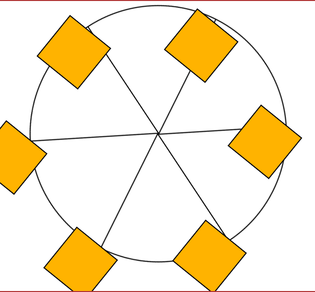

# FCC FERRIS WHEEL

> A fcc ferris wheel webpage built Using CSS animation.



## Built With

- HTML5 Properties,
  `span`, `div`,

- CSS Properties,

- .wheel;
  `border`, `border-radius`, `margin-left`, `position`,
  `height`, `width`, `max-width`, `max-height`, `animation-name`
  `animation-duration`, `animation-iteration-count`
  `animation-timing-function`

- .line:nth-of-type(2);
  `transform`

- .line:nth-of-type(3);
  `transform`

- .cabin;
  `background-color`, `width`, `height` `position`
  `border`, `transform-origin`, `animation`

- .cabin:nth-of-type(4);
  `left`, `top` etc.

  - Linters
  - [Prettier](https://prettier.io/),
  - [Stylelint](https://stylelint.io/).

- GitHub Action

## Live Demo

[Live Demo Link](https://oladele-18-fcc-ferris-wheel.netlify.app/)

### Development (Running locally)

- Clone the project

```bash
git clone git@github.com:olayinka-oladele/18-fcc-ferris-wheel.git

```

- Install Dependencies

```bash
yarn install
```

To run StyleLint by itself, you may run the lint task:

```bash
yarn lint:check
```

Or to automatically fix issues found (where possible):

```bash
yarn lint
```

You can also check against Prettier:

```bash
yarn format:check
```

and to have it fix (to the best of its ability) any format issues, run:

```bash
yarn format
```

You can also check against Webhint:

```bash
yarn hint
```

## Style Guides

- [CSS Style Guide](http://udacity.github.io/frontend-nanodegree-styleguide/css.html)
- [HTML Style Guide](http://udacity.github.io/frontend-nanodegree-styleguide/index.html)
- [Git Style Guide](https://udacity.github.io/git-styleguide/)

## 👤 Author

- Github: [@olayinka-oladele](https://github.com/olayinka-oladele)
- Freecodecamp: [@olayinka-oladele](https://freecodecamp.com/author)
- Linkedin: [@olayinka-oladele](https://www.linkedin.com/in/author/)

## 🤝 Contributing

Contributions, issues and feature requests are welcome!

Feel free to check the [issues page](../../issues).

## Show your support

Give a ⭐️ if you like this project!

## Acknowledgments

- [freecodecamp](https://www.freecodecamp.org/learn/2022/responsive-web-design/learn-css-animation-by-building-a-ferris-wheel/step-29)

## 📝 License

[MIT licensed](./LICENSE).
